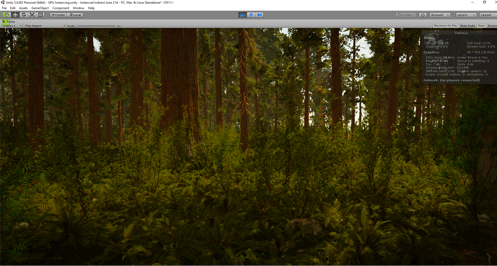

# UnityInstancingRepo

This is a tool built for Unity 5.6 which leverages the power of DrawMeshInstancedIndirect and Compute Shaders to allow rendering of 
vast and dense scenes without succumbing to the CPU bottleneck associated with increasing Draw Calls.

