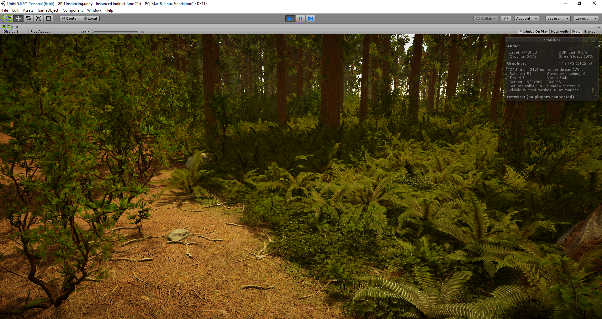
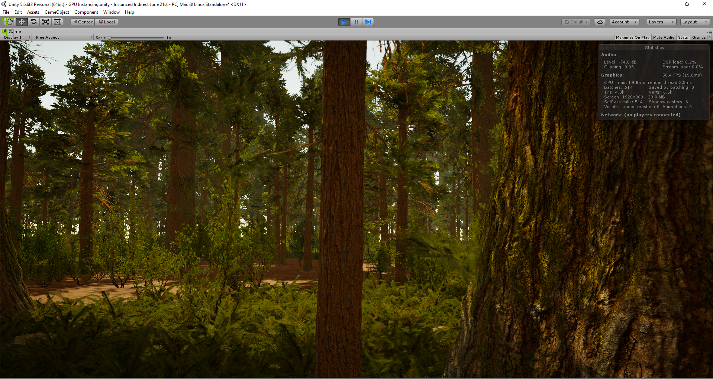
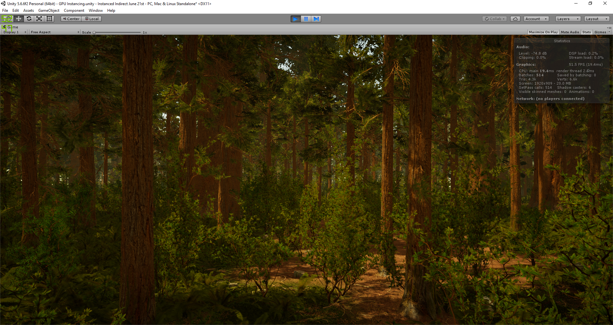
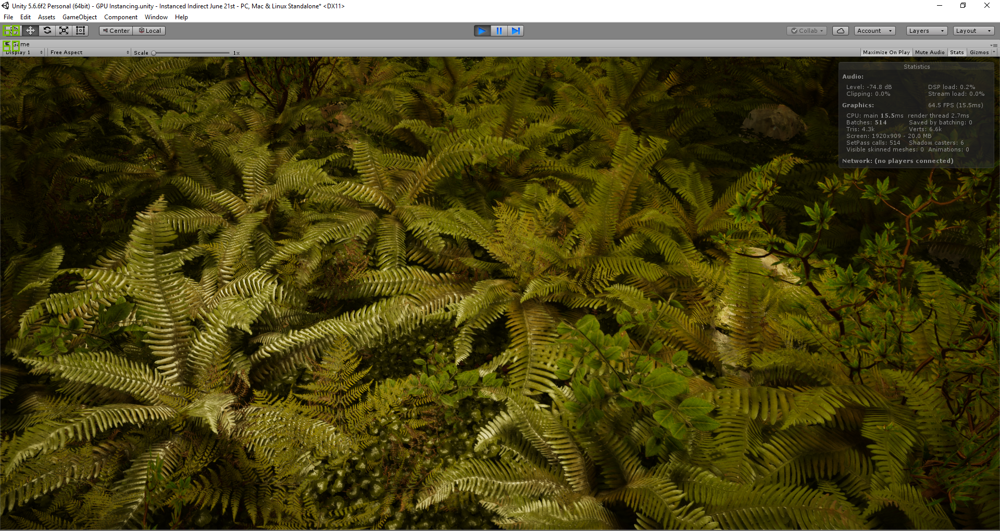
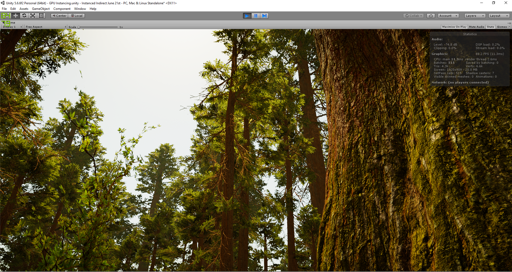
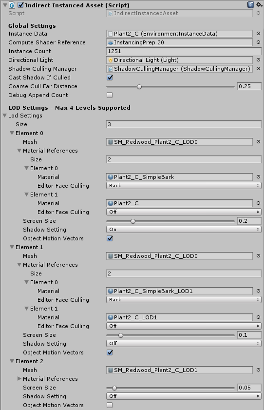
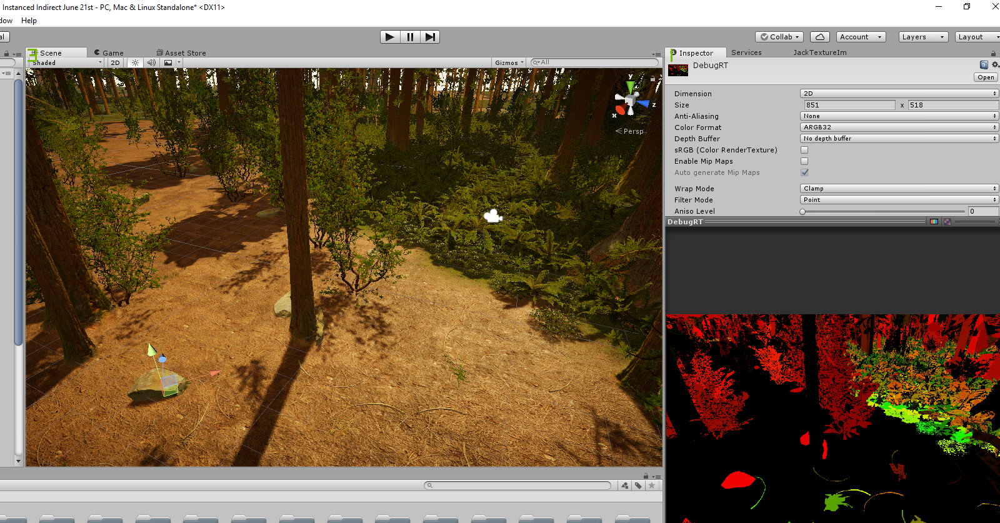

# Unity Dx11 Instancing Tool

This is a tool built for Unity 5.6 which leverages the power of DrawMeshInstancedIndirect and Compute Shaders to allow rendering of 
vast and dense scenes without succumbing to the CPU bottleneck associated with increasing Draw Calls. The below images show some examples of a demo scene using the framework, where the assets are from Mawi's Redwood Forest pack. The scene has over 8 million instances in total comprised of ground clutter/foliage/rocks/trees. 

# Youtube Video of the Demo Scene

The tool has several advanced features including:
- Screen space LODing with up to 4 LODs. Supports a coarse far cull distance to provide an early out before computing screen space size for more thorough culling.
- Proper shadow caster culling. Large objects which are frustum culled but whose shadows are still visible within the camera frustum are correctly rendered during a shadowcaster pass.
- Support for motion vectors pass. The Redwood scene has foliage with vertex shaders providing wind animation, the motion vectors for these animations are required in order to properly support Temporal Anti-Aliasing and Motion Blur.
- Support for tessellation. A common issue is that Unity does not support instancing for shaders implementing tessellation. This is overcome by taking the hlsl code created by Unity's surface shaders, and preventing barycentric interpolation on the SV_InstanceID attribute when it is passed down the pipeline.
- Support for procedural generation of transforms based on constraints. Can sample the splat map of the terrain and decide which textures to spawn what assets on (foliage on grass, twigs on dirt etc). Offers 2 different spawning algorithms, Uniform spawning and Stratified spawning.
- Support for editor picking. Gizmos that control positioning/rotating/scaling assets are the same as Unity's and thus the entire toolset is transparent to the user when working with the editor. It is possible to simulataneously multi-select Unity GameObjects and Instances, and then apply transform changes to both at the same time. There is also undo support via Crtl+Z which operates in the exact same way as Unitys. It is in fact possible to modify the transforms for a group of Unity GameObjects and Instances at the same time, and then undo those changes with a single Ctrl+Z. As such, all editor integration is completely transparent. 

The below image is an example of how the picking works. Any instanced object in the entire scene can be selected, and the control data to do so is printed out to "DebugRT". You can see however that the tree trunks cannot be selected, this is because the tessellation altered the depth value of those fragments, and when those same fragments are rendered in the picking pass without tessellation, they fail the depth test against the current depth buffer. 

Limitations:
- As of current, scene picking does not work properly with instances using shaders implementing either tessellation or alpha cutout. The reason for this is, as of current, the shader that renders control data for scene picking does not have any notion of alpha cutout or tesselation, but is rather a naive shader. A fix to this in the long term would be to write a custom shader preprocessor that reads the source shader file, and builds a picking pass that pulls the vertex shader from the original shader and incorporates it. Similarly, the fragment shader would be scanned for the clip alpha test, as well as all instructions that the clip test depends on (reading an alpha channel from a texture for example), and incorporate those into the fragment shader for the picking pass. On the other hand, convex objects like a rock that are not tessellated behave as expected and can be picked properly. 
