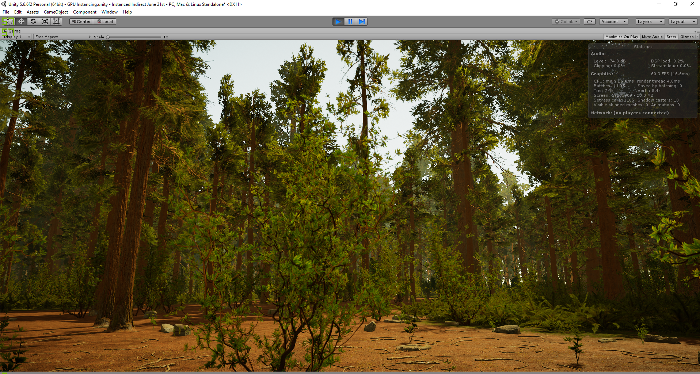

# UnityInstancingRepo

This is a tool built for Unity 5.6 which leverages the power of DrawMeshInstancedIndirect and Compute Shaders to allow rendering of 
vast and dense scenes without succumbing to the CPU bottleneck associated with increasing Draw Calls. The below images show some examples of a demo scene using the framework, where the assets are from Mawi's Redwood Forest pack. The scene has over 8 million instances in total comprised of ground clutter/foliage/rocks/trees. 

